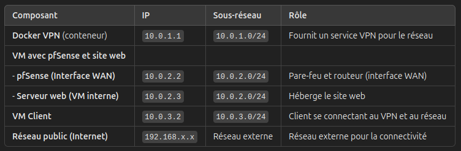

 Sous-réseau 1 : Réseau privé pour le VPN (Docker)

    Plage d'adresses IP : 10.0.1.0/24
        Gateway (Docker VPN) : 10.0.1.1
        Plage IP pour les conteneurs Docker : 10.0.1.2 - 10.0.1.50

Sous-réseau 2 : Réseau local pour pfSense et le serveur web

    Plage d'adresses IP : 10.0.2.0/24
        Gateway (pfSense) : 10.0.2.1 (pfSense sera le routeur pour ce réseau)
        VM avec le site web et pfSense (serveur web et pare-feu) :
            Adresse IP de pfSense : 10.0.2.2 (l'interface WAN de pfSense)
            Adresse IP du serveur web (hébergé sur cette VM) : 10.0.2.3

Sous-réseau 3 : Réseau privé pour le client

    Plage d'adresses IP : 10.0.3.0/24
        Gateway (pfSense) : 10.0.3.1
        VM Client :
            Adresse IP du client : 10.0.3.2

Réseau public (si applicable pour la connexion à Internet)

    Plage d'adresses IP : 192.168.0.0/24 (ou selon votre réseau externe réel)

